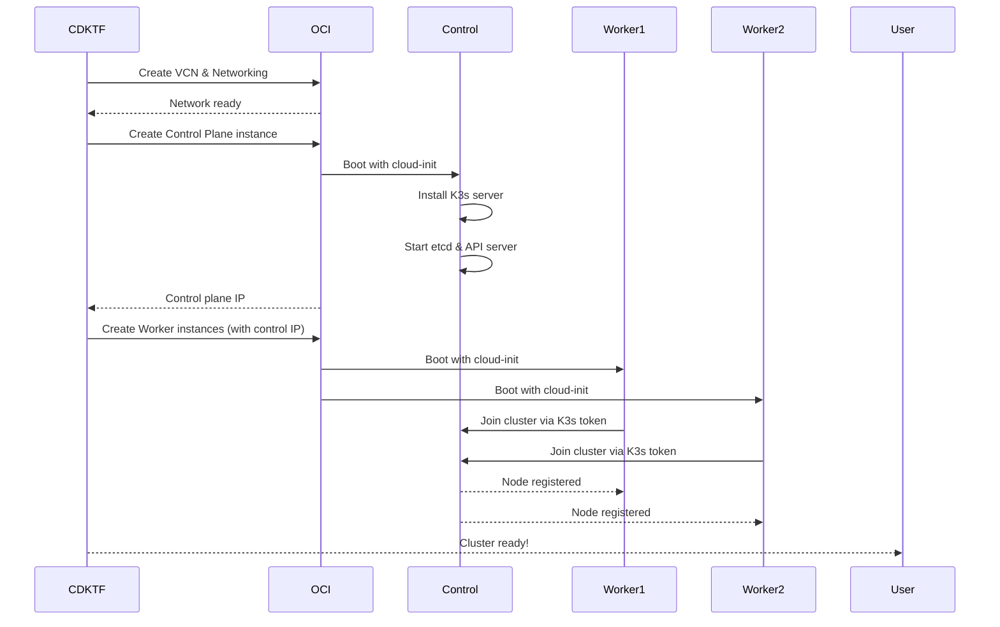

# Architecture - Oracle Cloud K3s Cluster

## 🏗️ Infrastructure Overview

This setup creates a production-ready K3s cluster using Oracle Cloud's Always Free tier.

## 📊 Resource Topology

```
Oracle Cloud Free Tier (Region: us-ashburn-1)
│
├── Virtual Cloud Network (VCN)
│   ├── CIDR: 10.0.0.0/16
│   ├── DNS Label: k3svcn
│   │
│   ├── Internet Gateway
│   │   └── Allows outbound internet and inbound to public IPs
│   │
│   ├── Route Table
│   │   └── Route: 0.0.0.0/0 → Internet Gateway
│   │
│   ├── Security List
│   │   ├── Ingress:
│   │   │   ├── TCP 22 (SSH) from 0.0.0.0/0
│   │   │   ├── TCP 6443 (K8s API) from 0.0.0.0/0
│   │   │   ├── TCP 80 (HTTP) from 0.0.0.0/0
│   │   │   ├── TCP 443 (HTTPS) from 0.0.0.0/0
│   │   │   └── All protocols from 10.0.0.0/16 (internal)
│   │   └── Egress:
│   │       └── All protocols to 0.0.0.0/0
│   │
│   └── Subnet
│       ├── CIDR: 10.0.1.0/24
│       ├── DNS Label: k3ssubnet
│       ├── Public IPs: Enabled
│       │
│       ├── k3s-control-1 (VM.Standard.A1.Flex)
│       │   ├── Role: Control Plane
│       │   ├── CPU: 2 OCPUs (ARM Ampere A1)
│       │   ├── RAM: 12 GB
│       │   ├── Disk: 50 GB
│       │   ├── Private IP: 10.0.1.x
│       │   ├── Public IP: Assigned
│       │   ├── OS: Oracle Linux 8 (aarch64)
│       │   └── Software:
│       │       ├── K3s Server (control plane)
│       │       ├── etcd (embedded)
│       │       └── K3s API Server
│       │
│       ├── k3s-worker-1 (VM.Standard.A1.Flex)
│       │   ├── Role: Worker
│       │   ├── CPU: 1 OCPU (ARM Ampere A1)
│       │   ├── RAM: 6 GB
│       │   ├── Disk: 50 GB
│       │   ├── Private IP: 10.0.1.y
│       │   ├── Public IP: Assigned
│       │   ├── OS: Oracle Linux 8 (aarch64)
│       │   └── Software:
│       │       └── K3s Agent (worker)
│       │
│       └── k3s-worker-2 (VM.Standard.A1.Flex)
│           ├── Role: Worker
│           ├── CPU: 1 OCPU (ARM Ampere A1)
│           ├── RAM: 6 GB
│           ├── Disk: 50 GB
│           ├── Private IP: 10.0.1.z
│           ├── Public IP: Assigned
│           ├── OS: Oracle Linux 8 (aarch64)
│           └── Software:
│               └── K3s Agent (worker)
```

## 🔧 Technical Specifications

### Compute Resources

| Component | Instance Type | vCPU | RAM | Storage | Arch |
|-----------|--------------|------|-----|---------|------|
| Control Plane | VM.Standard.A1.Flex | 2 | 12 GB | 50 GB | ARM64 |
| Worker 1 | VM.Standard.A1.Flex | 1 | 6 GB | 50 GB | ARM64 |
| Worker 2 | VM.Standard.A1.Flex | 1 | 6 GB | 50 GB | ARM64 |
| **Total** | - | **4** | **24 GB** | **150 GB** | - |

**Note**: Oracle Free Tier allows 4 OCPUs + 24GB RAM total for ARM instances, and 200GB block storage total.

### Network Configuration

- **VCN CIDR**: 10.0.0.0/16
- **Subnet CIDR**: 10.0.1.0/24
- **Available IPs**: 251 usable IPs in subnet
- **Egress**: Through Internet Gateway (10TB/month free)
- **Ingress**: Public IPs on all instances

### K3s Configuration

- **Version**: Latest stable (auto-updated by install script)
- **Cluster Init**: `--cluster-init` (embedded etcd, HA-ready)
- **Disabled Components**: Traefik (to allow custom ingress)
- **Networking**: Flannel (default K3s CNI)
- **Service Mesh**: None (can add later)
- **Token**: Randomly generated, shared via cloud-init

## 🔄 Data Flow

### Cluster Bootstrap Process



### Application Traffic Flow

```
Internet
    │
    ↓
Public IP (OCI)
    │
    ↓
Security List (Firewall)
    │
    ↓
Instance (k3s node)
    │
    ↓
K3s Service (LoadBalancer/NodePort)
    │
    ↓
K8s Pod
```

## 🛡️ Security Architecture

### Network Security

1. **Security Lists** (OCI's security groups)
   - Default deny all
   - Allow SSH from anywhere (can be restricted)
   - Allow K8s API (6443) from anywhere
   - Allow HTTP/HTTPS for ingress
   - Allow all traffic within VCN (10.0.0.0/16)

2. **Firewall** (on instances)
   - firewalld enabled by default on Oracle Linux
   - Ports opened for K3s operation:
     - 6443 (K8s API)
     - 10250 (Kubelet)
     - 8472 (Flannel VXLAN)
     - 51820-51821 (Flannel Wireguard)
     - 2379-2380 (etcd, control plane only)

3. **Public IPs**
   - All instances have public IPs (free tier limitation)
   - Can be restricted via security lists
   - Consider VPN or bastion for production

### Kubernetes Security

1. **RBAC** - Default K3s RBAC enabled
2. **Pod Security** - Can add Pod Security Standards
3. **Network Policies** - Can add Calico/Cilium for network policies
4. **Secrets** - K3s uses etcd for secret storage (encrypted at rest)

## 📈 Scalability

### Current Limits

- **Nodes**: 3 (1 control + 2 workers)
- **Pods**: ~110 per node (K8s default)
- **Services**: No hard limit
- **Ingress**: Limited by instance bandwidth

### Scaling Options

1. **Horizontal Pod Autoscaling** ✅
   - Can deploy metrics-server
   - HPA works within resource limits

2. **Vertical Pod Autoscaling** ✅
   - Can install VPA
   - Limited by node resources

3. **Cluster Autoscaling** ❌
   - Free tier has fixed resources
   - Would need paid instances

4. **Add More Workers** ⚠️
   - Can add 1 more ARM instance (split OCPU/RAM differently)
   - Or add x86 free tier VMs (much weaker)

### Alternative Configurations

#### Option 1: High Availability (HA) Control Plane
```
- 3x Control Planes (1 OCPU, 4GB each)
- 1x Worker (1 OCPU, 12GB)
```
Pros: HA control plane, better for production
Cons: Less worker capacity

#### Option 2: Maximum Worker Capacity
```
- 1x Control Plane (1 OCPU, 6GB)
- 3x Workers (1 OCPU, 6GB each)
```
Pros: More worker nodes for pod spreading
Cons: Under-provisioned control plane

#### Option 3: Current (Balanced)
```
- 1x Control Plane (2 OCPU, 12GB)
- 2x Workers (1 OCPU, 6GB each)
```
Pros: Balanced, good for homelab
Cons: Single point of failure for control plane

## 🔌 Integration Points

### With seb-homelab-k8s-iac

Your existing K8s IaC repo can deploy to this cluster:

```bash
# Get kubeconfig
make kubeconfig
export KUBECONFIG=~/.kube/oracle-k3s-config

# Deploy from k8s-iac repo
cd /Users/seb/repos/seb-homelab-k8s-iac
kubectl apply -f applications/argocd/manifests/
```

### Storage

**Options for persistent storage:**

1. **Block Volumes** (recommended)
   - OCI free tier: 200GB total
   - Can use CSI driver
   - Need to configure OCI CSI plugin

2. **Longhorn** (self-hosted)
   - Uses instance local storage
   - Replication across nodes
   - Already in your homelab setup!

3. **NFS** (DIY)
   - Mount external NFS
   - Or setup NFS server on one node

### Load Balancing

**Options for exposing services:**

1. **NodePort** (simplest)
   - Use public IPs directly
   - Port range: 30000-32767

2. **OCI Load Balancer** (free tier includes 1)
   - 10 Mbps bandwidth
   - Flexible load balancer
   - Requires OCI CCM (Cloud Controller Manager)

3. **MetalLB** (DIY)
   - Software load balancer
   - Use public IPs as pool
   - Similar to your Proxmox setup

### Ingress

**Recommended options:**

1. **Gateway API** (modern)
   - Your homelab already uses this!
   - Deploy gateway-api controllers

2. **Ingress Nginx**
   - Mature, well-tested
   - NodePort or LoadBalancer

3. **Traefik**
   - K3s default (currently disabled)
   - Can re-enable if desired

## 📊 Monitoring & Observability

### Built-in (OCI)

- **OCI Monitoring**: Free metrics for instances
- **OCI Logging**: Free logs (basic)
- **OCI Notifications**: Free alerts

### Can Deploy

- **Prometheus**: Metrics collection
- **Grafana**: Visualization
- **Loki**: Log aggregation (consider resource usage)
- **Kube-state-metrics**: K8s metrics

## 🎯 Design Decisions

### Why K3s instead of K8s?

- **Lightweight**: Uses less resources (~50% less than full K8s)
- **ARM-optimized**: Built for edge/ARM environments
- **Single binary**: Easy to install and maintain
- **Production-ready**: Used by many organizations
- **Feature-complete**: Everything you need for homelab

### Why ARM instead of x86?

- **Free tier**: ARM gets 4 OCPU + 24GB vs x86 gets 2 OCPU + 2GB total
- **Performance**: Ampere A1 CPUs are excellent
- **Efficiency**: Better performance per watt
- **Modern**: ARM is the future!

### Why Public IPs on all nodes?

- **Free tier requirement**: OCI free tier doesn't include NAT gateway
- **Simplicity**: Easy to access and debug
- **Can lock down**: Security lists can restrict access
- **Future**: Can add NAT gateway if moving to paid tier

## 📚 References

- [K3s Architecture](https://docs.k3s.io/architecture)
- [OCI Free Tier](https://docs.oracle.com/en-us/iaas/Content/FreeTier/freetier.htm)
- [OCI Networking](https://docs.oracle.com/en-us/iaas/Content/Network/Concepts/overview.htm)
- [Ampere A1 Specs](https://www.oracle.com/cloud/compute/arm/)
